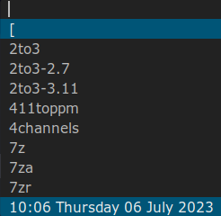

date
=============

Description
-----------
This patch adds date and time at the bottom of the vertical dmenu layout, using the `date` command with arguments. 

Download
--------
[dmenu-date-5.2.diff](dmenu-date-5.2.diff) (2023-07-05)

Authors
-------
* Piotr Marendowski <piotr-marendowski@tutanota.com>

